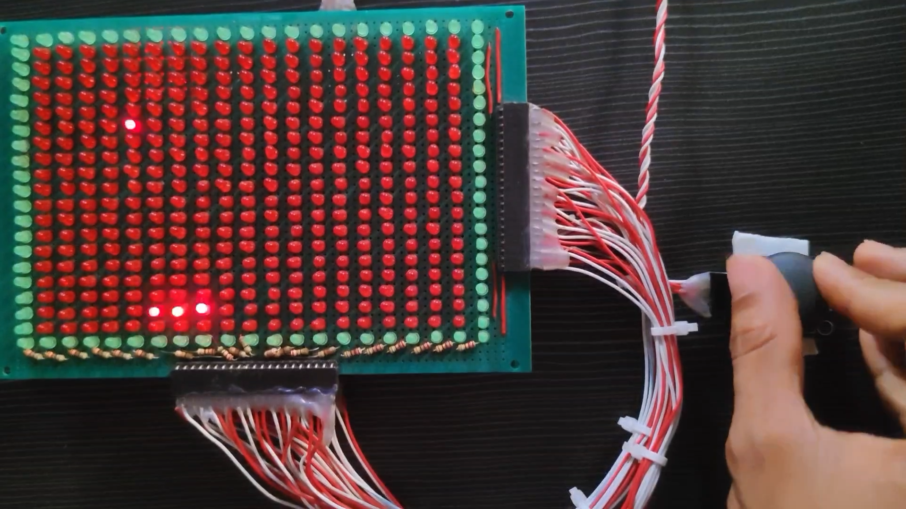

# Matrix

This repository hosts the firmware and hardware design files for an LED matrix game implemented on an Atmega328p microcontroller. The project utilizes shift registers for controlling the grounds and VCCs of the LED matrix, providing efficient control over the display. The firmware includes a classic snake game, offering an engaging user experience that can be controlled using a joystick.

## Complete Project Setup 

## Circuit Design

1. Matrix Circuit Back

2. Matrix Circuit Front

3. Controller Circuit

## Snake Game in the Matrix

## Demonstration video

[Watch a demo on YouTube](https://youtu.be/gwCfVdZ9tuk)

